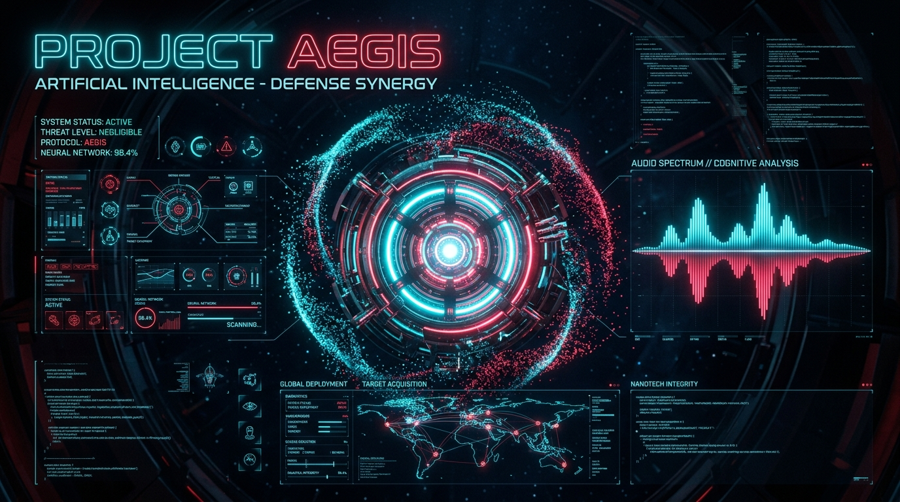

<div align="center">



# 🛡️ PROJECT AEGIS
### Next-Gen JARVIS & ULTRON Futuristic AI Web Interface

[](https://knecrow.github.io/Aegis/)
[](LICENSE)
[](https://ai.google.dev/)

<p align="center">
  A futuristic, browser-based cybernetic HUD experience inspired by Marvel's JARVIS and ULTRON. Featuring real-time conversational intelligence powered by Google Gemini, speech synthesis & recognition, interactive nanotech particle swarms, and Web Audio spectrum analysis.
</p>

</div>

---

## ✨ Key Features

- 🧠 **Google Gemini Intelligence**: Real-time natural language understanding and responses tailored with custom tactical AI personalities.
- 🎙️ **Voice Interaction & Speech Synthesis**: Full speech-to-text input paired with synthesized voice output for seamless hands-free communication.
- 🌌 **Interactive Nanotech Swarm**: High-performance HTML5 Canvas / WebGL particle dynamics reacting in real time to mouse interactions, audio levels, and system states.
- 📊 **Live Web Audio Spectrum**: Real-time visual audio waveform analyzer reacting to microphone and voice output.
- ⚡ **Tactical Cyberpunk HUD**: Glassmorphic UI overlays, animated telemetry widgets, diagnostic panels, and futuristic sound effects.

---

## 🛠️ Tech Stack

- **Core Logic**: Vanilla JavaScript (ES6+ modular architecture)
- **AI Backend**: Google Gemini Pro API
- **Audio Processing**: HTML5 Web Audio API & Web Speech API (Synthesis & Recognition)
- **Visuals & Animation**: HTML5 Canvas 2D / WebGL particle system
- **Styling**: Modern CSS3 (Glassmorphism, custom HUD keyframes, CSS Grid & Flexbox)

---

## 🚀 Quick Start

### 1. Clone the repository
```bash
git clone https://github.com/Knecrow/Aegis.git
cd Aegis
```

### 2. Configure API Key
Open your configuration / settings and supply your Google Gemini API key:
```javascript
const GEMINI_API_KEY = "YOUR_GOOGLE_GEMINI_API_KEY";
```

### 3. Run Locally
Serve the application using any static HTTP server or VS Code Live Server:
```bash
# Using Python built-in server:
python -m http.server 8000
```
Then navigate to `http://localhost:8000` in your browser.

---

## 🎮 How to Use
1. **Initialize System**: Click the central Arc Core to initialize the audio subsystem and particle swarm.
2. **Engage Voice / Text**: Click the microphone icon or type queries in the tactical command line.
3. **Toggle Protocols**: Switch between JARVIS (Guardian/Analytical) and ULTRON (Overclocked/Assertive) operational modes.

---

## 📄 License
Distributed under the MIT License. See `LICENSE` for details.
<!-- yolo achievement trigger -->
